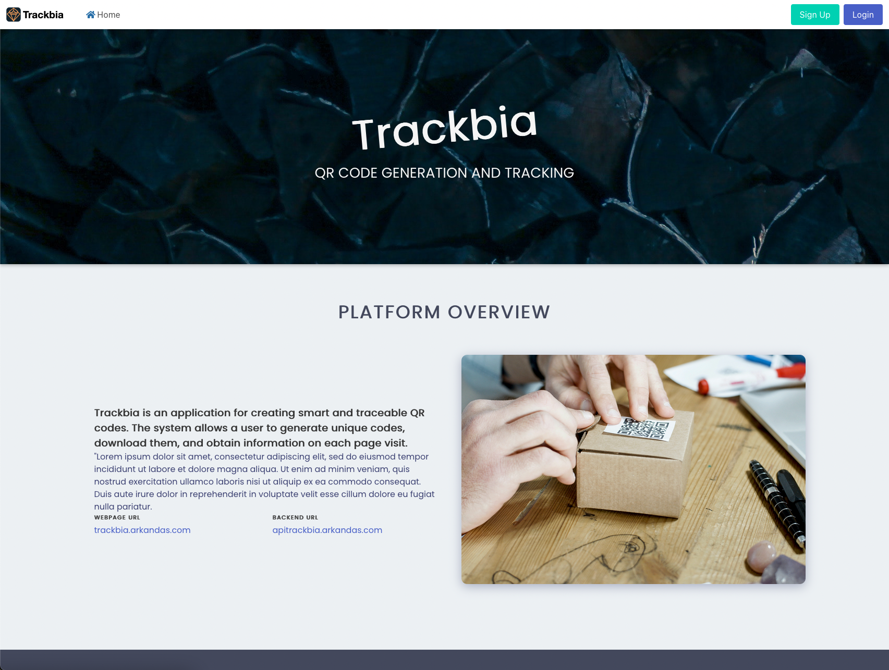
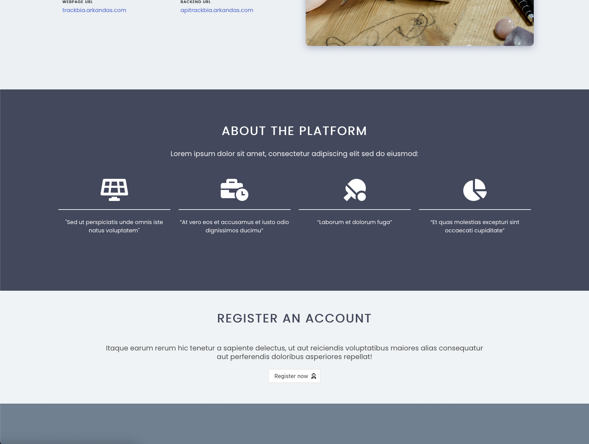
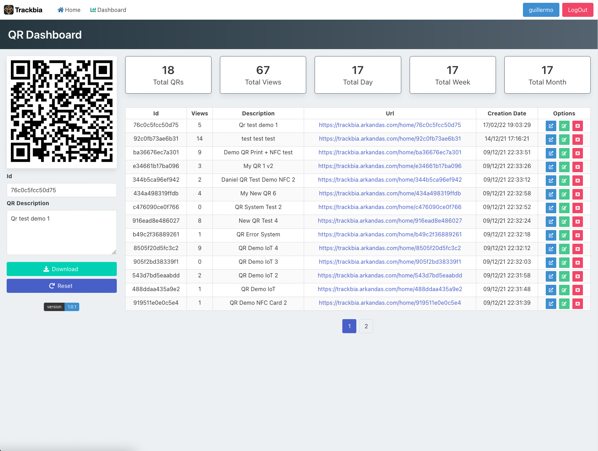
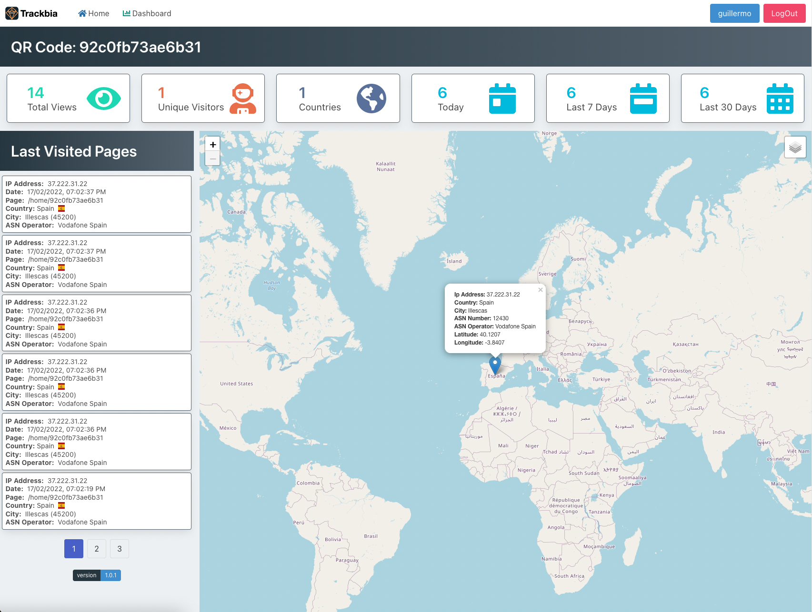
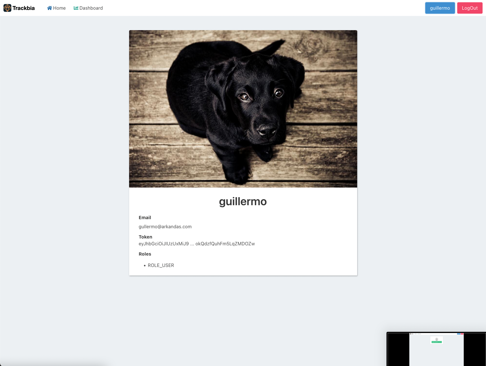
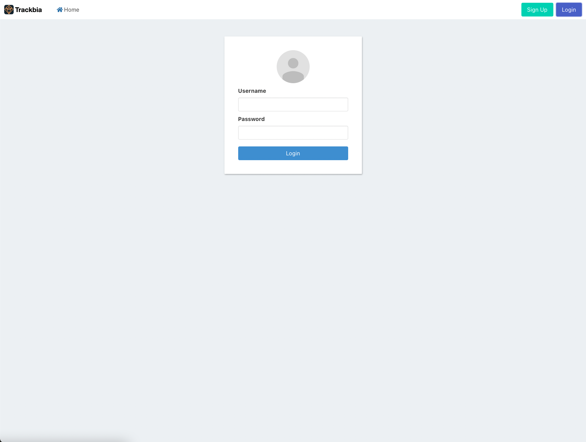

# Trackbia

Trackbia is an application for creating smart and traceable QR codes. This platform allows a user to generate unique QR codes, download them, and generate page view analytics from each visit.

Demo: [Trackbia](https://trackbia.arkandas.com)

## Usage

```bash
docker compose up -d
```

This will deploy 3 containers:

```bash
[+] Running 3/3
 ⠿ Container trackbia-postgres-db-1     Created
 ⠿ Container trackbiaback               Created
 ⠿ Container trackbiafront              Created
```

Once the containers are running, the following services are available:

- <http://localhost:8012> - Angular App
- <http://localhost:8011> - Spring Boot API
- <http://localhost:8011/swagger-ui.html> - API Documentation
- jdbc:postgresql://localhost:5432/trackbia - PostgreSQL Database

For more deployment information, check the [docker-compose](https://github.com/arkandas/trackbia/blob/main/docker-compose.yaml) file.

## Screenshots







