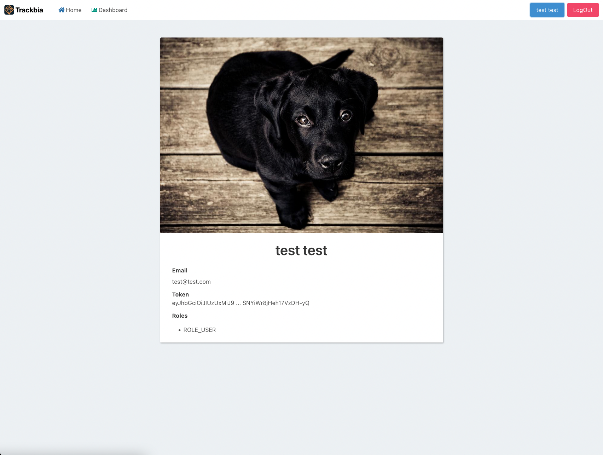

# Trackbia

Trackbia is an application for creating smart and traceable QR codes. This platform allows a user to generate unique QR codes, download them, and generate page view analytics from each visit.

Demo: [Trackbia](https://trackbia.arkandas.com)

## Screenshots

